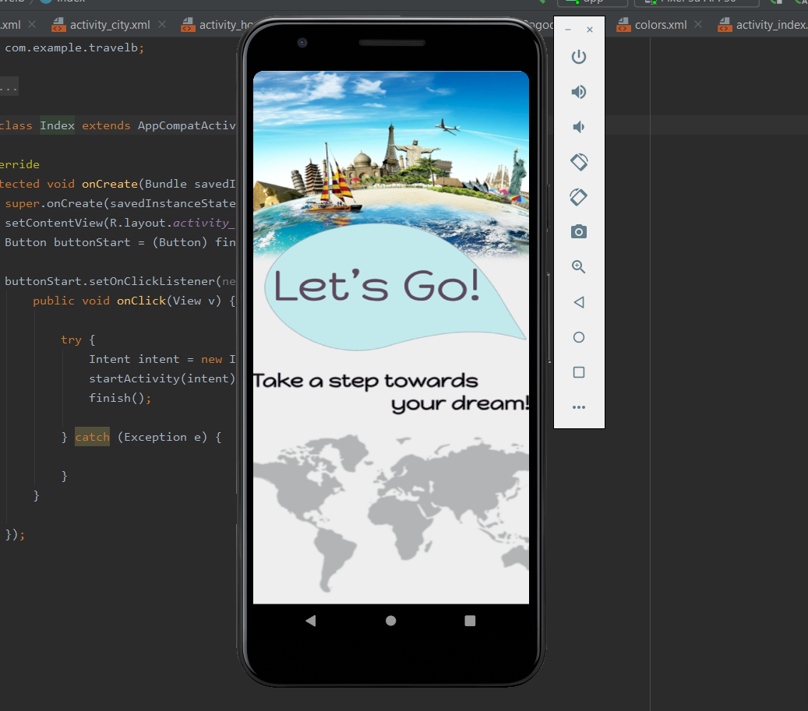
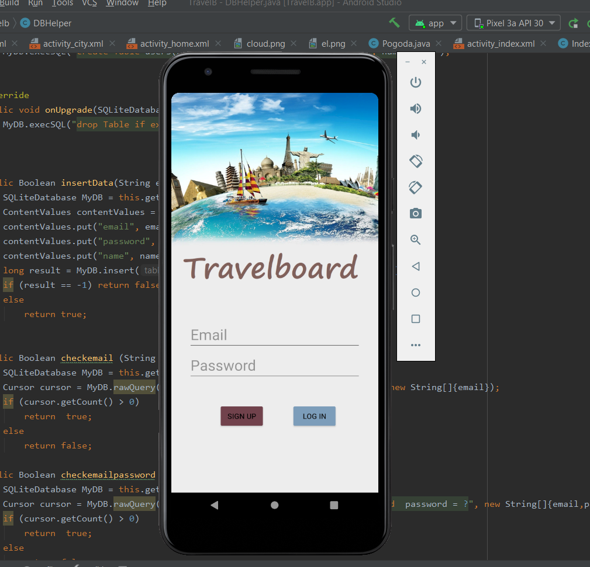
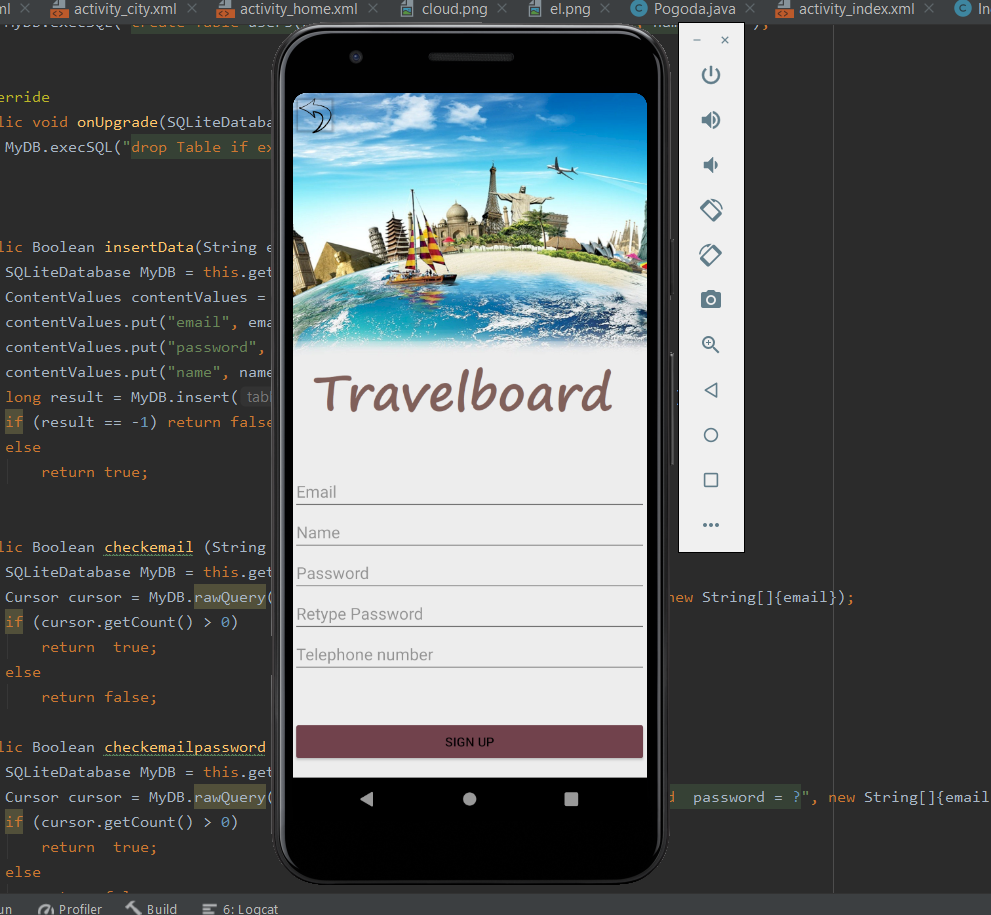
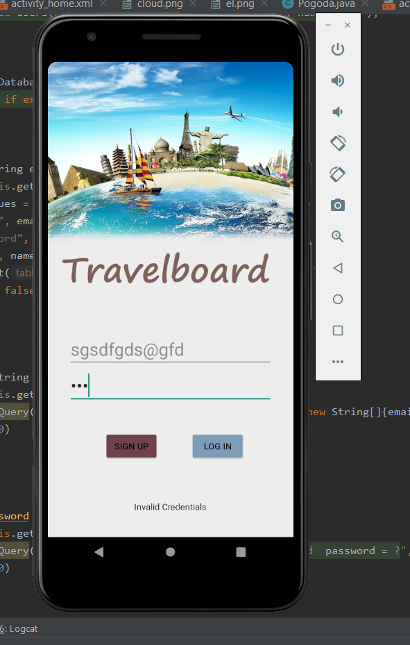
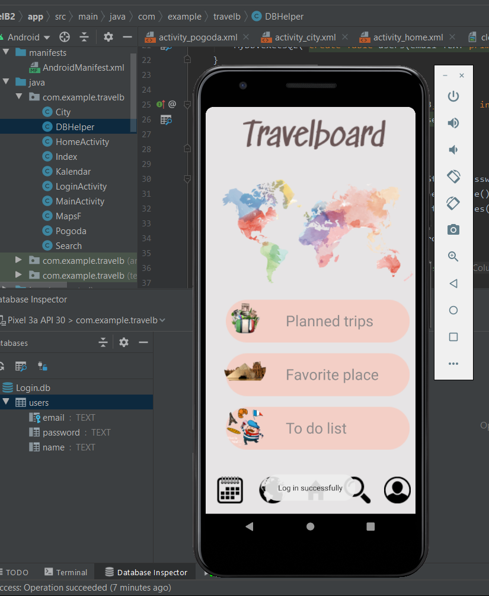
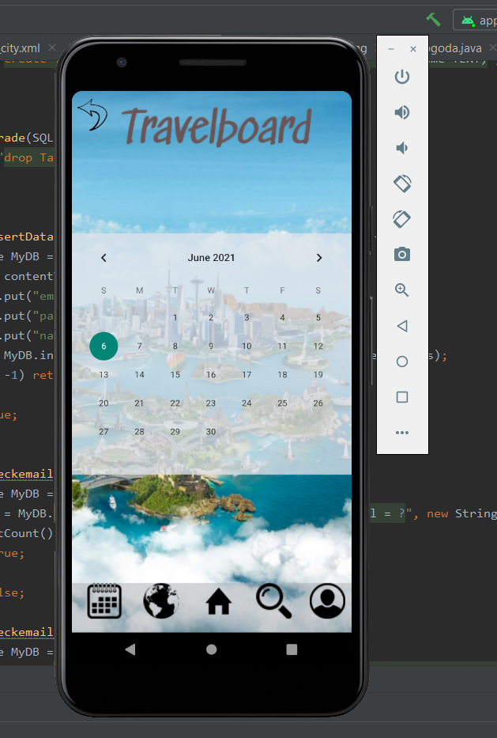
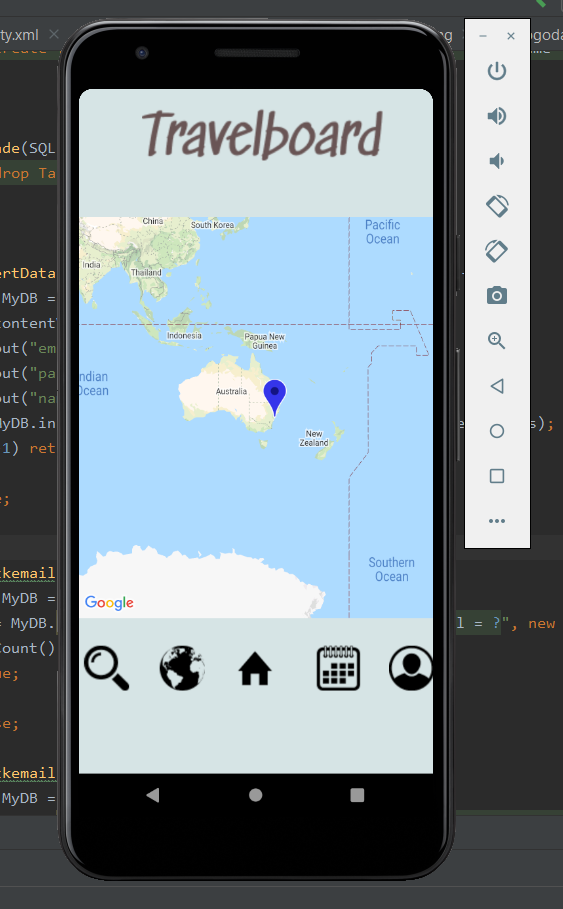
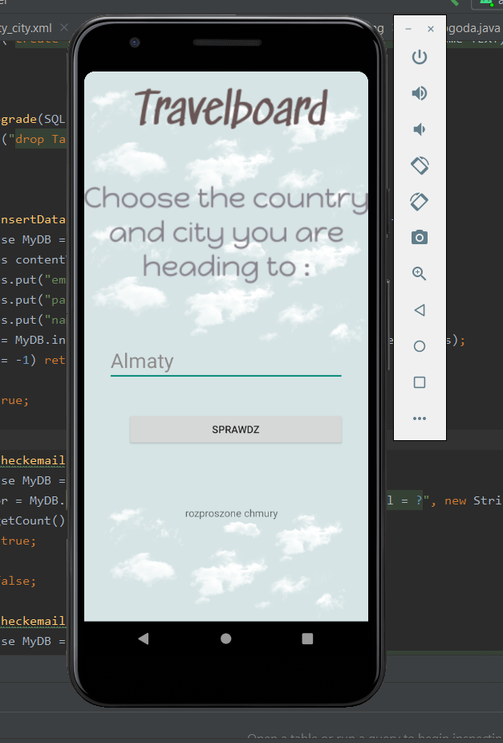
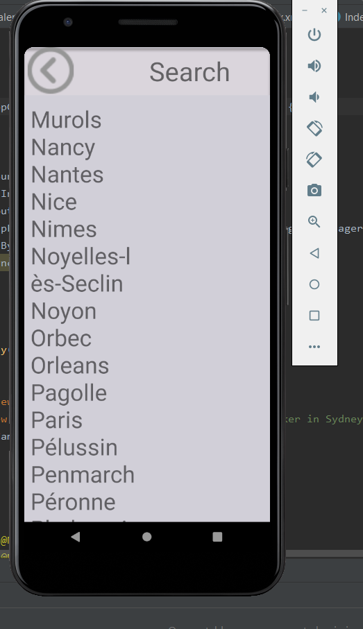
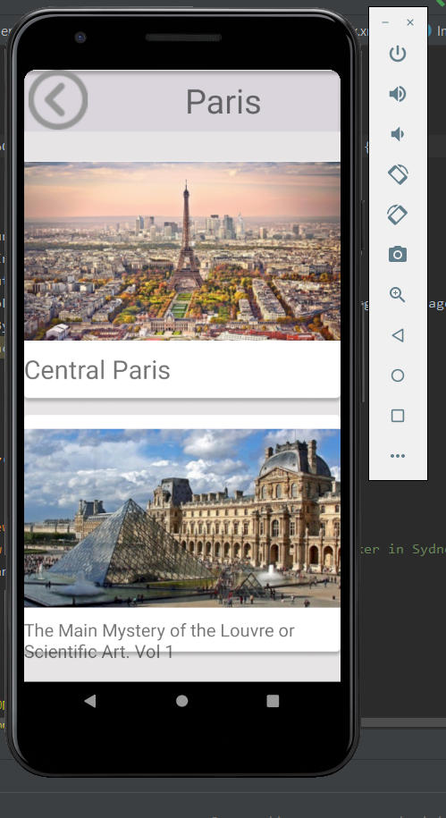

# TravelboardAndroid

### 1. Charakterystyka  oprogramowania 
Nazwa skrócona: TravelBoard

Nazwa pełna: TravelBoard - asystent podróżnika

Krótki opis: Aplikacja mobilna służąca jako asystent podróży, która pomoże użytkownikowi w wyborze atrakcji w podróży, pokazująca prognozę pogody w określonym miejscu, wyświetla mapę regionu i kalendarz. 

### Aplikacja zawierajaca: 
* Podłączenie bazy danych
* Rejestracja/Logowanie użytkowników
* Wyświetlenie informacje meteorologiczne w zakładce "Pogoda"
* Wyświetlenie mapę regionu
* Kalendarz 

### Strona startowa


### Strona Logowania i Rejestracji 


#### W przypadku niezarejestrowanego użytkownika wyświetla się komunikat "Invalid Credentials"

#### W przypadku udanego logowania "Log in successfully"


## Podłączenie do bazy danych SQLite 
```
 public Boolean insertData(String email, String password, String name) {
        SQLiteDatabase MyDB = this.getWritableDatabase();
        ContentValues contentValues = new ContentValues();
        contentValues.put("email", email);
        contentValues.put("password", password);
        contentValues.put("name", name);
        long result = MyDB.insert("users", null, contentValues);
        if (result == -1) return false;
        else
            return true;
    }

    public Boolean checkemail (String email) {
        SQLiteDatabase MyDB = this.getWritableDatabase();
        Cursor cursor = MyDB.rawQuery("Select * from users where email = ?", new String[]{email});
        if (cursor.getCount() > 0)
            return  true;
        else
            return false;
    }
    public Boolean checkemailpassword (String email, String password) {
        SQLiteDatabase MyDB = this.getWritableDatabase();
        Cursor cursor = MyDB.rawQuery("Select * from users where email = ? and  password = ?", new String[]{email,password});
        if (cursor.getCount() > 0)
            return  true;
        else
            return false;
  ```
  #### W przypadku rejestracji są kontrole na zgodność haseł, czy istnieje już użytkownik czy nie. Jeżeli wypelnione wszystkie warunki - wyświetli śię komunikat "Registered successfully"
  ```
  
                if(user.equals("") || password.equals("")|| repassword.equals(""))
                    Toast.makeText(LoginActivity.this, "Please enter all the fields", Toast.LENGTH_SHORT).show();
                else{
                    if(password.equals(repassword)){
                        Boolean checkuser = DB.checkemail(user);
                        if(checkuser==false){
                            Boolean insert = DB.insertData(user, password, nameU);
                            if(insert==true) {
                                Toast.makeText(LoginActivity.this, "Registered successfully", Toast.LENGTH_SHORT).show();
                                Intent intent = new Intent(getApplicationContext(), HomeActivity.class);
                                startActivity(intent);
                            }else{
                                Toast.makeText(LoginActivity.this, "Registration failed", Toast.LENGTH_SHORT).show();
                            }
                        }
                        else {
                            Toast.makeText(LoginActivity.this, "User already exists! please sign in", Toast.LENGTH_SHORT).show();
                        }
                    } else {
                        Toast.makeText(LoginActivity.this, "Password not matching ", Toast.LENGTH_SHORT).show();
                    }
                }
            }
        });
  ```
          
#### Wchodzimy na stroną profilu użytkowniku. Na dole widzimy menu nawigacyjne 

#### Kalendarz

#### Mapa

#### Pogoda

#### Wybór miasta i atrakcji


